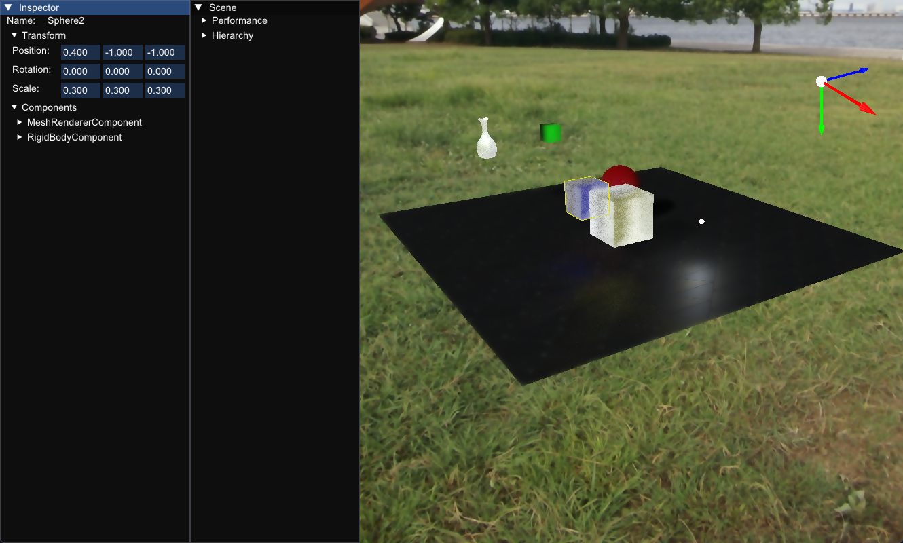

# FeatherVK

FeatherVK is a C++17 + Vulkan renderer project with an ECS-based scene runtime, editor picking, gizmos, and configurable rasterization / ray tracing pipelines.



## Current Features

- C++17 project, CMake build, Vulkan backend
- ECS runtime (`SceneRegistry`) with component lifecycle (`Awake/Start/Update/LateUpdate/FixedUpdate`)
- Scene/material/component data loaded from JSON in `Configurations/`
- Editor-style interaction:
  - object ID picking (left click)
  - hierarchy + inspector (ImGui)
  - selected object outline + gizmos axis
- Camera and object controls (keyboard/mouse)
- Two rendering data sets:
  - `Configurations/RayTracing`
  - `Configurations/Rasterization`

## Build Requirements

- Windows
- CMake >= 3.25
- C++17 compiler (Visual Studio 2022 recommended)
- Vulkan SDK installed and available in environment
- Git (for `FetchContent` dependencies)

## Build

```powershell
cmake -S . -B build
cmake --build build --config Debug
```

Dependencies fetched by CMake:

- `glfw` (3.4)
- `glm` (1.0.1)

## Run

Run from the `build` directory so shader relative paths resolve correctly:

```powershell
cd build
.\Debug\FeatherVK.exe
```

If you launch from IDE, set working directory to `.../FeatherVK/build`.

## Controls

- Right mouse + drag: rotate camera
- `W/A/S/D/Q/E`: move camera
- Left mouse click in scene viewport: pick/select entity
- `F`: focus camera on current selected entity
- Arrow keys: move selected entity on X/Z plane (when scene input is not captured by UI)

## Configuration Notes

- Runtime scene data:
  - `Configurations/RayTracing/*.json`
  - `Configurations/Rasterization/*.json`
- Cubemap textures are loaded from `Textures/Cubemap/` using fixed file names:
  - `posx.jpg`, `negx.jpg`, `posy.jpg`, `negy.jpg`, `posz.jpg`, `negz.jpg`

## Rendering Mode Switch

Rendering path is currently selected by macro in `Source/Device.hpp`:

- `#define RAY_TRACING` enabled: use ray tracing configuration path
- comment out `RAY_TRACING`: use rasterization path

Rebuild after changing this macro.
