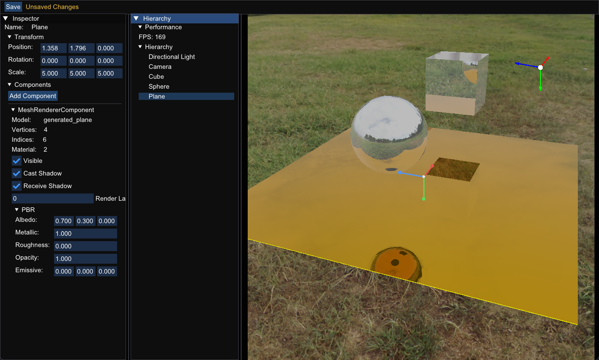

# FeatherVK

[](https://deepwiki.com/TLRUA/FeatherVK)

FeatherVK is a C++17 Vulkan renderer/editor project with an EnTT-based ECS, ImGui editor, rasterization, ray tracing, hybrid rendering, and a staged render architecture.

**Documentation:** [Ask DeepWiki about FeatherVK](https://deepwiki.com/TLRUA/FeatherVK)



## Features

- Vulkan renderer with optional ray tracing.
- Render architecture: `RHI -> RenderCore -> RenderScene -> RenderGraph`.
- ImGui editor with hierarchy, inspector, picking, gizmos, outline, dirty-state Save button, and Add Component workflow.
- Entity presets: Empty, Cube, Sphere, Cylinder, Plane, Torus, Lights, Camera, and basic UI objects.
- Editable components: Transform, MeshRenderer, Light, Camera, RigidBody, UI, and movement/input components.
- JSON-backed scene, component, and material data.
- Ray traced reflections, shadows, environment sampling, denoise, and hybrid raster + RT effects.
- Render-side RT instance lifecycle, TLAS reason tracking, deferred resource release, and descriptor update caching.

## Architecture

```text
Application / Editor
  -> LogicManager / ResourceManager / RenderManager
  -> RenderScene
  -> RenderGraph
  -> RenderCore
  -> RHI / Vulkan
```

Key folders:

- `Source/RHI/` - low-level rendering abstraction.
- `Source/RenderCore/` - shader, pipeline, material, and render resource infrastructure.
- `Source/RenderScene/` - extracted render-side scene data.
- `Source/RenderGraph/` - pass graph, graph-owned resources, barriers, and execution.
- `Source/RenderSystems/` - raster, shadow, skybox, grass, picking, gizmo, post, compute, and RT systems.
- `Configurations/` - JSON scene/material/component data.
- `Shaders/` - GLSL and SPIR-V shaders.

## Build

Requirements:

- Windows
- CMake 3.25+
- Visual Studio 2022 or another C++17 compiler
- Vulkan SDK
- Git

```powershell
cmake -S . -B build
cmake --build build --config Debug --target FeatherVK
```

Run:

```powershell
.\build\Debug\FeatherVK.exe
```

## Rendering Mode

Rendering mode is selected in `Source/Device.hpp`:

- `#define RAY_TRACING` enabled: ray tracing / hybrid path.
- `RAY_TRACING` disabled: rasterization path.

Rebuild after changing the macro.

## Shaders

Compiled `.spv` files are checked in. Recompile after changing shader source:

```powershell
cd Shaders
.\compileAllShaders.bat
```

Update the `glslc.exe` path in the batch file if needed.

## Controls

- Right mouse + drag: rotate camera.
- `W/A/S/D/Q/E`: move camera.
- Left click in Scene viewport: pick entity.
- `F`: focus selected entity.
- Drag gizmo axis: translate selected entity.
- Hierarchy right click: create entities.
- Inspector `Add Component`: add supported components.
- Top `Save`: write dirty scene changes to JSON.

## Scene Data

```text
Configurations/
  Rasterization/
  RayTracing/
```

Each mode has its own `Entities.json`, `Components.json`, and `Materials.json`.

## Notes

- Assets are loaded from `Models/`, `Textures/`, and `Textures/Cubemap/`.
- Current path uses graph-owned Vulkan render pass/framebuffer objects, not dynamic rendering.
- Set `FEATHERVK_RT_DIAGNOSTICS=1` to log TLAS build/update diagnostics.